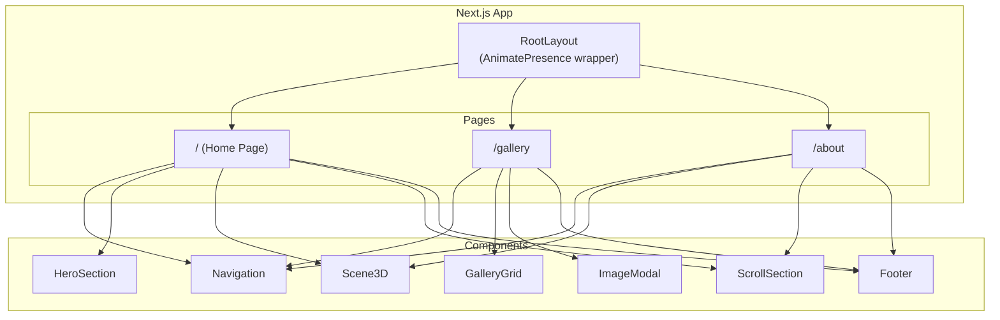

# Design Document

## Overview

This design document outlines the architecture and implementation approach for an advanced Lamborghini website redesign. The website will feature immersive 3D experiences using React Three Fiber and Drei, sophisticated animations powered by GSAP and Framer Motion, and a premium dark aesthetic befitting the Lamborghini brand. The site consists of three pages: Home (hero + featured content), Gallery (interactive image showcase), and About (brand story + contact).

## Architecture

### Technology Stack

```
┌─────────────────────────────────────────────────────────────┐
│                      Next.js 16 (App Router)                │
├─────────────────────────────────────────────────────────────┤
│  UI Layer                                                   │
│  ├── React 19                                               │
│  ├── Tailwind CSS 4 (styling)                               │
│  └── Framer Motion (page transitions, component animations) │
├─────────────────────────────────────────────────────────────┤
│  Animation Layer                                            │
│  ├── GSAP + ScrollTrigger (scroll animations, timelines)    │
│  └── Framer Motion (micro-interactions, layout animations)  │
├─────────────────────────────────────────────────────────────┤
│  3D Layer                                                   │
│  ├── Three.js (3D rendering engine)                         │
│  ├── React Three Fiber (React renderer for Three.js)        │
│  └── Drei (R3F helpers: Environment, Float, Html, etc.)     │
└─────────────────────────────────────────────────────────────┘
```

### Page Structure



## Components and Interfaces

### Core Components

#### 1. Navigation Component
```typescript
interface NavigationProps {
  currentPath: string;
}

// Features:
// - Fixed position header with blur backdrop
// - GSAP magnetic hover effect on menu items
// - Framer Motion staggered menu animation
// - Mobile hamburger menu with animated open/close
```

#### 2. HeroSection Component
```typescript
interface HeroSectionProps {
  title: string;
  subtitle: string;
  backgroundImage: string;
}

// Features:
// - Full viewport height
// - GSAP timeline for text reveal (split text animation)
// - Framer Motion for image entrance
// - Mouse parallax effect on background
```

#### 3. Scene3D Component
```typescript
interface Scene3DProps {
  intensity?: number;
  enableInteraction?: boolean;
  fallbackImage?: string;
}

// Features:
// - React Three Fiber Canvas
// - Drei Environment for lighting
// - Drei Float for ambient object movement
// - Drei Html for loading states
// - WebGL fallback detection
```

#### 4. GalleryGrid Component
```typescript
interface GalleryImage {
  src: string;
  alt: string;
  title: string;
}

interface GalleryGridProps {
  images: GalleryImage[];
  onImageSelect: (image: GalleryImage) => void;
}

// Features:
// - CSS Grid with responsive columns
// - Framer Motion 3D tilt on hover
// - GSAP ScrollTrigger staggered reveal
// - Click to expand functionality
```

#### 5. ImageModal Component
```typescript
interface ImageModalProps {
  image: GalleryImage | null;
  isOpen: boolean;
  onClose: () => void;
}

// Features:
// - Framer Motion AnimatePresence for enter/exit
// - Shared layout animation from grid to modal
// - Backdrop blur with fade
// - Keyboard navigation (ESC to close)
```

#### 6. ScrollSection Component
```typescript
interface ScrollSectionProps {
  children: React.ReactNode;
  animation?: 'fade' | 'slide' | 'reveal' | 'parallax';
  direction?: 'up' | 'down' | 'left' | 'right';
}

// Features:
// - GSAP ScrollTrigger integration
// - Multiple animation presets
// - Configurable trigger points
// - Performance-optimized with will-change
```

### Animation Utilities

#### GSAP Utilities
```typescript
// hooks/useGSAP.ts
interface GSAPAnimationConfig {
  trigger: RefObject<HTMLElement>;
  animation: gsap.TweenVars;
  scrollTrigger?: ScrollTrigger.Vars;
}

// Magnetic effect for buttons/links
function useMagneticEffect(ref: RefObject<HTMLElement>, strength?: number): void;

// Split text animation
function useSplitText(ref: RefObject<HTMLElement>, config?: SplitTextConfig): void;

// Parallax scroll effect
function useParallax(ref: RefObject<HTMLElement>, speed?: number): void;
```

#### Framer Motion Variants
```typescript
// lib/animations.ts
const pageTransition: Variants = {
  initial: { opacity: 0, y: 20 },
  animate: { opacity: 1, y: 0 },
  exit: { opacity: 0, y: -20 }
};

const staggerContainer: Variants = {
  animate: {
    transition: { staggerChildren: 0.1 }
  }
};

const fadeInUp: Variants = {
  initial: { opacity: 0, y: 60 },
  animate: { opacity: 1, y: 0 }
};

const tilt3D: Variants = {
  rest: { rotateX: 0, rotateY: 0 },
  hover: { rotateX: -5, rotateY: 5, scale: 1.05 }
};
```

### 3D Scene Components

#### ParticleField Component
```typescript
interface ParticleFieldProps {
  count?: number;
  color?: string;
  size?: number;
}

// Features:
// - Drei Points for particle rendering
// - Animated position using useFrame
// - Mouse-reactive movement
```

#### AmbientScene Component
```typescript
interface AmbientSceneProps {
  preset?: 'sunset' | 'night' | 'studio';
}

// Features:
// - Drei Environment with HDR presets
// - Drei ContactShadows
// - Drei Float wrapper for objects
// - Responsive quality settings
```

## Data Models

### Image Data Structure
```typescript
interface LamboImage {
  id: string;
  src: string;
  alt: string;
  title: string;
  description?: string;
  category?: 'exterior' | 'interior' | 'action';
}

// Available images from public folder:
const LAMBO_IMAGES: LamboImage[] = [
  { id: '1', src: '/2nalambo.png', alt: 'Lamborghini', title: 'Aventador' },
  { id: '2', src: '/amalambo.png', alt: 'Lamborghini', title: 'Huracán' },
  { id: '3', src: '/dmalambo.png', alt: 'Lamborghini', title: 'Urus' },
  { id: '4', src: '/lastlambo.png', alt: 'Lamborghini', title: 'Revuelto' },
  { id: '5', src: '/redlambo.png', alt: 'Lamborghini', title: 'Countach' },
  { id: '6', src: '/walkinglabo.png', alt: 'Lamborghini', title: 'Sián' }
];
```

### Navigation Structure
```typescript
interface NavItem {
  label: string;
  href: string;
  isActive?: boolean;
}

const NAV_ITEMS: NavItem[] = [
  { label: 'Home', href: '/' },
  { label: 'Gallery', href: '/gallery' },
  { label: 'About', href: '/about' }
];
```

### Animation Configuration
```typescript
interface AnimationConfig {
  duration: number;
  ease: string;
  delay?: number;
}

const ANIMATION_DEFAULTS: AnimationConfig = {
  duration: 0.8,
  ease: 'power3.out',
  delay: 0
};
```


## Correctness Properties

*A property is a characteristic or behavior that should hold true across all valid executions of a system-essentially, a formal statement about what the system should do. Properties serve as the bridge between human-readable specifications and machine-verifiable correctness guarantees.*

Based on the acceptance criteria analysis, the following properties can be formally verified:

### Property 1: Gallery Image Completeness

*For any* set of Lamborghini images provided to the GalleryGrid component, all images SHALL be rendered in the DOM with correct src attributes and alt text.

**Validates: Requirements 4.1**

### Property 2: Responsive Layout Adaptation

*For any* viewport width less than 768 pixels, the gallery grid SHALL render with a single-column layout (grid-template-columns resolving to a single column).

**Validates: Requirements 7.1**

### Property 3: Navigation Item Rendering

*For any* set of navigation items provided to the Navigation component, all items SHALL be rendered as clickable links with correct href attributes.

**Validates: Requirements 2.1, 2.3**

### Property 4: Image Modal State Consistency

*For any* gallery image, clicking the image SHALL set the modal state to open with the correct image data, and closing the modal SHALL reset the state to closed with null image data.

**Validates: Requirements 4.3, 4.5**

### Property 5: WebGL Fallback Rendering

*For any* Scene3D component instance, when WebGL is not supported, the component SHALL render the fallback image instead of the 3D canvas.

**Validates: Requirements 5.4**

## Error Handling

### 3D Rendering Errors

| Error Scenario | Handling Strategy |
|----------------|-------------------|
| WebGL not supported | Display fallback static image with graceful degradation message |
| 3D asset load failure | Show placeholder geometry with retry option |
| Context lost | Attempt automatic recovery, fall back to 2D if persistent |

### Image Loading Errors

| Error Scenario | Handling Strategy |
|----------------|-------------------|
| Image fails to load | Display placeholder with Lamborghini logo |
| Slow network | Show skeleton loader with blur-up effect |
| Invalid image path | Log error, render placeholder |

### Animation Errors

| Error Scenario | Handling Strategy |
|----------------|-------------------|
| GSAP initialization fails | Disable scroll animations, show static content |
| Framer Motion error | Catch in ErrorBoundary, render without animation |
| Performance degradation | Reduce animation complexity dynamically |

### Navigation Errors

| Error Scenario | Handling Strategy |
|----------------|-------------------|
| Route not found | Display custom 404 page with navigation options |
| Navigation timeout | Show loading indicator, allow retry |

## Testing Strategy

### Testing Framework

- **Unit Testing**: Vitest (fast, Vite-native, excellent TypeScript support)
- **Property-Based Testing**: fast-check (JavaScript PBT library)
- **Component Testing**: React Testing Library
- **E2E Testing**: Playwright (optional, for critical user flows)

### Unit Testing Approach

Unit tests will verify:
- Component rendering with various props
- Hook behavior (useGSAP, useMagneticEffect, etc.)
- Utility function correctness
- State management logic

Example test structure:
```typescript
// components/GalleryGrid.test.tsx
describe('GalleryGrid', () => {
  it('renders all provided images', () => {
    const images = [/* test data */];
    render(<GalleryGrid images={images} onImageSelect={vi.fn()} />);
    expect(screen.getAllByRole('img')).toHaveLength(images.length);
  });
});
```

### Property-Based Testing Approach

Property tests will use fast-check to verify:
- Gallery renders all images regardless of count (Property 1)
- Responsive breakpoints work for any valid viewport width (Property 2)
- Navigation renders all items correctly (Property 3)
- Modal state transitions are consistent (Property 4)
- WebGL fallback works reliably (Property 5)

Configuration:
- Minimum 100 iterations per property test
- Tests tagged with format: `**Feature: lambo-website-redesign, Property {number}: {property_text}**`

Example property test:
```typescript
// components/GalleryGrid.property.test.tsx
import fc from 'fast-check';

describe('GalleryGrid Properties', () => {
  // **Feature: lambo-website-redesign, Property 1: Gallery Image Completeness**
  it('renders all provided images', () => {
    fc.assert(
      fc.property(
        fc.array(fc.record({
          id: fc.string(),
          src: fc.string(),
          alt: fc.string(),
          title: fc.string()
        }), { minLength: 0, maxLength: 20 }),
        (images) => {
          const { container } = render(
            <GalleryGrid images={images} onImageSelect={() => {}} />
          );
          const renderedImages = container.querySelectorAll('img');
          return renderedImages.length === images.length;
        }
      ),
      { numRuns: 100 }
    );
  });
});
```

### Test Organization

```
brandnewlambo/
├── __tests__/
│   ├── components/
│   │   ├── GalleryGrid.test.tsx
│   │   ├── GalleryGrid.property.test.tsx
│   │   ├── Navigation.test.tsx
│   │   ├── Navigation.property.test.tsx
│   │   ├── ImageModal.test.tsx
│   │   └── Scene3D.test.tsx
│   ├── hooks/
│   │   ├── useGSAP.test.ts
│   │   └── useMagneticEffect.test.ts
│   └── lib/
│       └── animations.test.ts
```

### Testing Guidelines

1. **Implementation First**: Write feature code before tests
2. **Property Tests for Core Logic**: Use fast-check for data-driven components
3. **Unit Tests for Edge Cases**: Cover specific scenarios and error conditions
4. **Avoid Mocking Animation Libraries**: Test component output, not animation internals
5. **Snapshot Testing**: Use sparingly for complex UI structures
